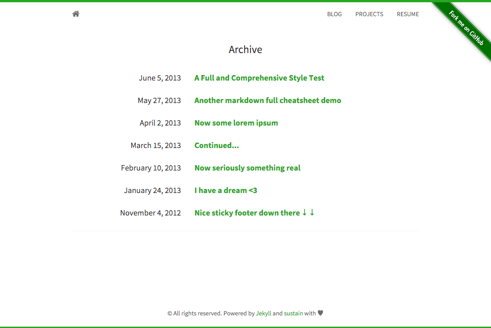
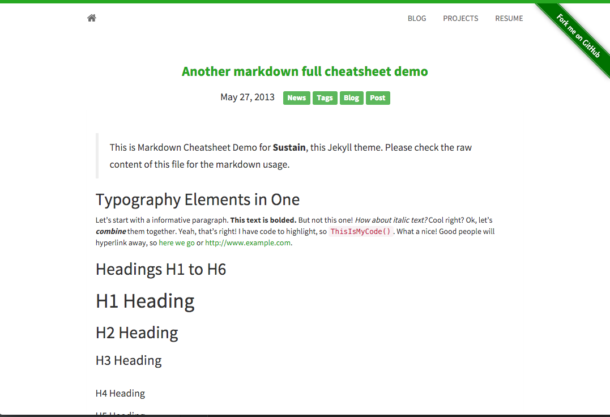
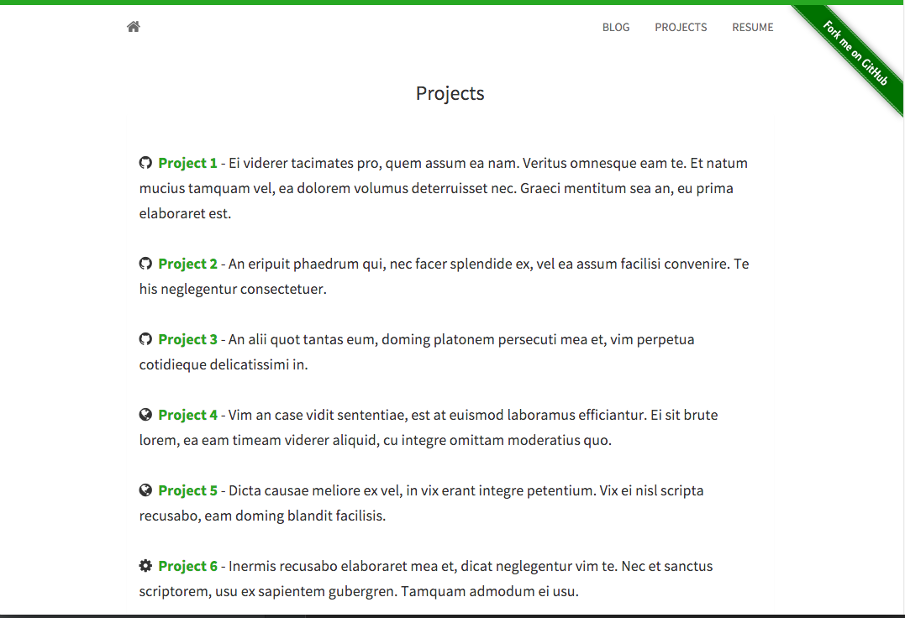

# Sustain

Personal blog built with [Bootstrap](http://getbootstrap.com/), powered by [Jekyll](http://jekyllrb.com/) and freely
hosted in [Github pages](https://pages.github.com/).

## View the live demo

[Sustain Live Demo](https://jekyllt.github.io/sustain)

## Screenshots

**Home page**

**Blog page**

**Post page**

**Projects page**

### Deployment

There are several alternatives to building and deploying the site:

1. build the site with [GitHub Actions](https://github.com/features/actions) which pushes 
the resulting files (the contents of `_site/` or `../sustain-pages/`) 
to the *gh-pages* branch. This is the approach that is currently used. See 
[jekyll_build.yml](.github/workflows/jekyll_build.yml) for more details.

2. generate the site locally (more details below) and push the resulting
HTML to a Github repository, that GitHub Pages then host;

3. build the site with [travis-ci](https://travis-ci.org/) (with goodies from
[jekyll-travis](https://github.com/mfenner/jekyll-travis)) automatically pushing the
generated HTML files to a *gh-pages* branch.

4. deploy the static website with Jekyll-compatible hosters, such as https://www.netlify.com/, that allow for deployment from the Github repo and publish the website using CDNs. Netlify has a free starter offer.

For option **2)** simply clone this repository (*master branch*), and then run
`bundle exec jekyll serve` inside the directory. Upload the resulting `_site/` (or `../sustain-pages/`)
contents to your repository (*master branch* if uploading as your personal page
(e.g. username.github.io) or *gh-pages branch* if uploading as a project page
(as for the [demo](https://github.com/jekyllt/sustain/tree/gh-pages)).

For option **3)** you will need to set up travis-ci for your personal fork. Briefly all you
need then is to change your details in *[\_config.yml](_config.yml)* so that you can push
to your github repo. You will also need to generate a secure key to add to your
*[.travis.yml](.travis.yml)* (you can find more info on how to do it in that file).
Also make sure you read the documentation from
[jekyll-travis](https://github.com/mfenner/jekyll-travis). This approach has clear
advantages in that you simply push your file changes to GitHub and all the HTML files
are generated for you and pushed to *gh-pages*. Also you get to know if everything is
still fine with your site builds. Don't hesitate to contact me if you still have any
issues (see below about issue tracking).

## Issues and contributing

This install builds well with Ruby v2.6.3 and Jekyll v3.9.0. If you run into any problems please log them on the [issue tracker](https://github.com/jekyllt/sustain/issues).

Feel free pull-request your patches and fixes.

## Thanks

Profile picture from [pexels](https://www.pexels.com/photo/portrait-black-african-ethnicity-person-9494/).

## Copyright & License

Copyright (C) 2015-2021 - Released under the MIT License.

Permission is hereby granted, free of charge, to any person obtaining a copy of this software and associated documentation files (the "Software"), to deal in the Software without restriction, including without limitation the rights to use, copy, modify, merge, publish, distribute, sublicense, and/or sell copies of the Software, and to permit persons to whom the Software is furnished to do so, subject to the following conditions:

The above copyright notice and this permission notice shall be included in all copies or substantial portions of the Software.

THE SOFTWARE IS PROVIDED "AS IS", WITHOUT WARRANTY OF ANY KIND, EXPRESS OR IMPLIED, INCLUDING BUT NOT LIMITED TO THE WARRANTIES OF MERCHANTABILITY, FITNESS FOR A PARTICULAR PURPOSE AND
NONINFRINGEMENT. IN NO EVENT SHALL THE AUTHORS OR COPYRIGHT HOLDERS BE LIABLE FOR ANY CLAIM, DAMAGES OR OTHER LIABILITY, WHETHER IN AN ACTION OF CONTRACT, TORT OR OTHERWISE, ARISING FROM, OUT OF OR IN CONNECTION WITH THE SOFTWARE OR THE USE OR OTHER DEALINGS IN THE SOFTWARE.
